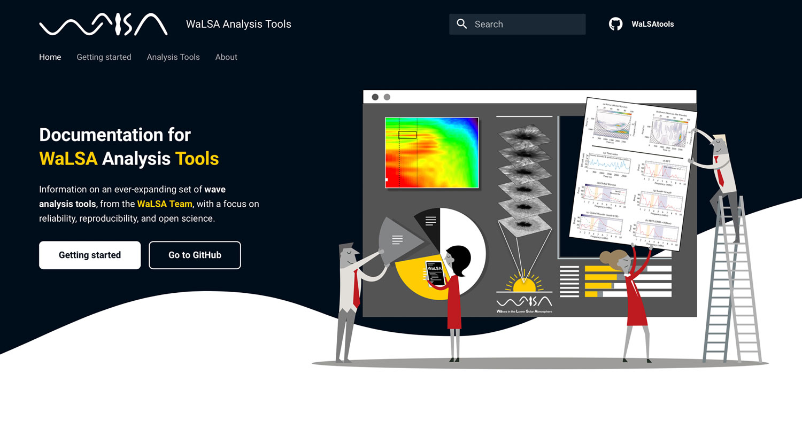

## WaLSAtools: WaLSA Analysis Tools

     
    
    
     
    

WaLSAtools is a collection of analysis routines (in both IDL and Python programming languages), collected and/or developed by the [**WaLSA team**](https://WaLSA.team), for studying waves and oscillations, with a particular emphasis on such phenomena occurring in the lower atmosphere of the Sun.

The main goal is to develop suitable techniques for various aspects of wave studies in the lower solar atmosphere (and beyond) — facilitating reliability and reproducibility of such analyses.

## Documentation

See the documentation at **[https://WaLSA.tools](https://WaLSA.tools)** for **getting started guides**, **descriptions**, **examples**, and all information about **WaLSAtools**.

:exclamation: The online documentation is currently password protected: 
**Username:** `WaLSA` 
**Password:** `WaLSA@8542`

---

### Link to working repository
