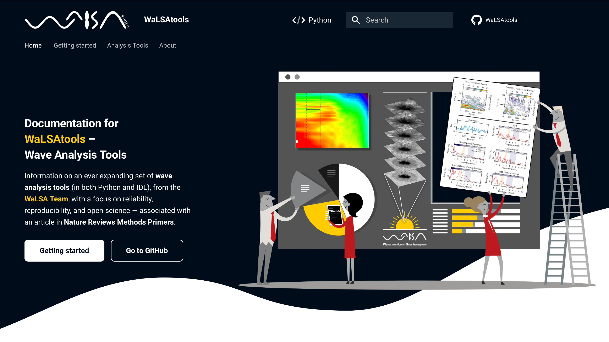

  

   

# WaLSAtools &ndash; Wave Analysis Tools

     
    
    
     
    

**WaLSAtools** is an open-source library for analysing a wide variety of wave phenomena in time series data, including images and multi-dimensional datasets. It provides tools to extract meaningful insights from complex datasets and is applicable across diverse fields, including astrophysics, engineering, physical and environmental sciences, and biomedical studies, among others. The library is continuously expanding with new features and functionalities, ensuring it remains a valuable resource for the wave analysis research.

The core of WaLSAtools is built upon Python, one of the most widely-used programming languages in science and engineering. This ensures accessibility and ease of use for a broad audience. We are actively developing counterparts in other popular languages to further enhance accessibility, enabling researchers from various backgrounds to leverage the power of WaLSAtools for their wave analysis needs. Currently, WaLSAtools is also available in IDL, with plans to expand to other languages in the future.

Developed by the [WaLSA Team](https://WaLSA.team), WaLSAtools was initially inspired by the intricate wave dynamics observed in the Sun's atmosphere. However, its applications extend far beyond solar physics, offering a versatile toolkit for anyone working with oscillatory signals.

WaLSAtools promotes reproducibility and transparency in wave analysis. Its robust implementations of both fundamental and advanced techniques ensure consistent and trustworthy results, empowering researchers to delve deeper into the complexities of their data. Through its interactive interface, WaLSAtools guides users through the analysis process, providing the necessary information and tools to perform various types of wave analysis with ease.

This repository is associated with a primer article titled *"Wave analysis tools"* in [**Nature Reviews Methods Primers**](https://www.nature.com/nrmp/) (NRMP; in press), showcasing its capabilities through detailed analyses of synthetic datasets. The `examples/Worked_examples__NRMP` directories (for both Python and IDL) contain reproducible codes for generating all figures presented in the NRMP article, serving as a practical guide for applying WaLSAtools to real-world analyses.

## **Key Features**

* **Wide Range of Wave Analysis Techniques:**  From foundational methods like FFT and wavelet analysis to advanced techniques such as EMD, k-ω, and POD analysis.
* **Cross-Disciplinary Applicability:**  Suitable for signal processing, oscillation studies, and multi-dimensional analysis in various fields.
* **Interactive Interfaces:** Simplified workflows through interactive menus for both Python and IDL.
* **Open Science Principles:** Promotes reproducibility and transparency in data analysis. 

## **Documentation**

The complete documentation, including installation guides, method descriptions, and usage examples, is available online:

**[WaLSAtools Documentation](https://WaLSA.tools)**

The documentation includes:
- Step-by-step installation instructions.
- Descriptions of implemented methods.
- Examples applied to synthetic datasets.

## **Repository Structure**

<pre>
WaLSAtools/
├── codes/
│   ├── python/                      # Python implementation of WaLSAtools
│   │   ├── WaLSAtools/              # Core library
│   │   ├── setup.py                 # Setup script for Python
│   │   └── README.md                # Python-specific README
│   ├── idl/                         # IDL implementation of WaLSAtools
│   │   ├── WaLSAtools/              # Core library
│   │   ├── setup.pro                # Setup script for IDL
│   │   └── README.md                # IDL-specific README
├── docs/                            # Documentation for WaLSAtools
├── examples/                        # Worked examples directory
│   ├── python/                      # Python-specific examples
│   │   └── Worked_examples__NRMP/
│   ├── idl/                         # IDL-specific examples
│   │   └── Worked_examples__NRMP/
├── LICENSE                          # License information
├── NOTICE                           # Copyright Notice
└── README.md                        # Main repository README
</pre>

## **Installation**

Refer to the `README.md` files in the `codes/python` and `codes/idl` directories for language-specific installation instructions. Further details are in the [online documentation](https://WaLSA.tools).

**Quick Start:**

1. Clone the repository: `git clone https://github.com/WaLSAteam/WaLSAtools`
2. **Python:** `pip install WaLSAtools` (within `codes/python/`)
3. **IDL:**  `.run setup.pro` (within `codes/idl/` in IDL)

## **Interactive Usage**

* **Python:** Type `from WaLSAtools import WaLSAtools; WaLSAtools` in a terminal (in Python) or in a Jupyter notebook.
* **IDL:** Run the command `WaLSAtools` (in IDl).

The interface guides you through selecting an analysis category, data type, and method, providing hints on calling sequences and parameters.

## **Citing WaLSAtools**

If you use WaLSAtools in your research, please consider citing:

> Jafrzadeh, S., Jess, D. B., Stangalini, M. et al. 2025, Nature Reviews Methods Primers, in press

> Jafrzadeh, S., Jess, D. B., Stangalini, M. et al. 2025, WaLSAteam/WaLSAtools: DOI TBD

## **License**

WaLSAtools is licensed under the [Apache License, Version 2.0](http://www.apache.org/licenses/LICENSE-2.0).
See the LICENSE file for details.
